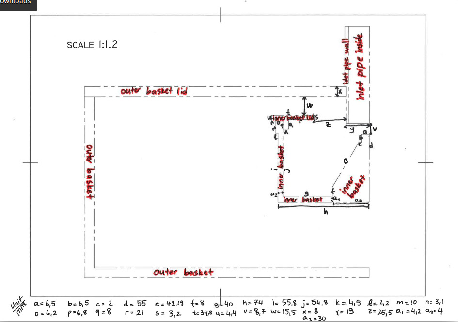

# DEMPhysics
This module adds centrifugal force and location-specific application of centrifugal and gravitational forces to LIGGGHTS-PUBLIC
This code is developed for the scientific article linked.

## Contributing Authors
- MSc. Damla Serper (Aalto Univeristy, Finland) '*corresponding author*'
- Dr. Kevin Hanley (University of Edinburgh, UK)

## How to use the code:
- Clone this directory into the LIGGGHTS-PUBLIC src directory on your local computer.
- Here you can use the provided .gitignore file to only stage the required files within your folder.  
- Copy and move fix_centrifugal.cpp, fix_centrifugal.h, fix_gravity.cpp and fix_gravity.h files from DEMPhysics folder to upper src directory, replacing the original LIGGGHTS-PUBLIC versions.
- Recompile the LIGGGHTS-PUBLIC.
- Here are some examples of how to add the centrifugal force and modified gravitational force within LIGGGHTS .in script:

  ### You are intending to use centrifugal force (keyword: centrifugal, 4 arguments)
    - Here the case is set for a submerging, stationary, cylindircal inlet pipe within a rotating centrifuge inner basket. We want to activate the centrifugal force only within the inner basket and outside of the inlet pipe.
    - param[0] = rotational speed
    - param[1] = radius of the inlet pipe
    - param[2] = lower y coordinate of the inlet pipe
    - param[3] = radius of the inner basket of the centrifuge
    - Example syntax: ```fix cent_fix all centrifugal 157.0796 0.017 -0.0033 0.069```

  ### You are inteding to use modified gravitational force (keyword: gravity, 5 arguments)
      - Here the case is set for a submerging, stationary, cylindircal inlet pipe within a rotating centrifuge inner basket. We want to activate the gravitational force only within the inner basket and outside of the inlet pipe, since the inlet pipe has a set flow rate we want to keep.
    - param[0] = radius of the inlet pipe
    - param[1] = lower y coordinate of the inlet pipe
    - param[2] = x vector direction to apply the acceleration
    - param[3] = y vector direction to apply the acceleration
    - param[4] = z vector direction to apply the acceleration
    - Example syntax: ```fix grav_fix all gravity 9.81 vector 0.017 -0.0033 0 -1 0``` 
- NOTE: Currently the rotation is assumed to be along y axis. Please refer to image below for understanding the set-up:




## Modifications to the original LIGGGHT-PUBLIC code:
### 1. fix_gravity.cpp
- Added lines 92-95: Initialising the variables for correction check later
- Added lines 142-180: Adding/modifying code for force attribution
- Added line 341: Defining variables for location limiting the force application
- Added lines 346-370: Defining the conditions inside or outside the inner basket and inlet pipe

### 2. fix_gravity.h
- Added lines 80-82: Defining variables for location limiting the force application
